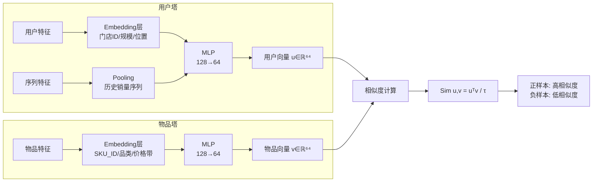

## Task2. 双塔模型（DSSM）

### `双塔模型（DSSM）—— 召回阶段的"向量引擎"`

> 核心思想：用户塔与物品塔独立编码 → 生成低维向量 → 通过向量相似度（内积/余弦）实现大规模候选集快速检索。

> 关键技术点：
>> 塔间隔离：训练时分离 → 推理时物品向量可离线预计算（关键性能优势）
>> 
>> 温度系数τ：控制相似度分布尖锐度（τ↓ → 正负样本区分更明显）
>> 
>> 序列特征：SequenceFeature支持历史行为建模（如门店过去4周销量序列）
>> 
>> 负采样：Point-wise模式需构造负样本（教程中neg_ratio=3）
>> 
>> 输出：用户/物品Embedding → 供Annoy/LanceDB等向量库检索

### 可能的适配场景
💡 快消场景适配：物品塔预计算300个SKU的向量（每日更新）；用户塔实时生成门店向量（融合当日天气/库存）；毫秒级召回Top50候选SKU。

#### ⚙ 关键改造点（针对快消特性）
| 问题 | 改造方案 |  业务价值 |
| --- | --- | --- |
| 复购率建模 |  在DSSM用户塔中，将历史销量序列加权（近期销量权重↑） | 捕捉"高频复购SKU"的时序模式 |
| 负采样偏差 | 避免随机负采样 → 采用"同品类低销量SKU"作为难负样本|  提升模型区分度（快消品品类内竞争激烈）|
| 上下文融合 | DeepFM中将天气温度、节假日作为DenseFeature | 精准预测季节性商品需求波动 |
| 图结构增强 | 用DGL训练门店-SKU异构图 → 生成Embedding注入双塔 | 利用300万+ 边的图结构捕捉隐式关联 |

### 心得体会：从课程学习到企业落地的思考

✅ 收获与启发
- 架构解耦的价值
> Torch-RecHub 将"特征定义→模型→训练器"完全解耦，使我能快速实验不同召回/精排组合（如DSSM+DeepFM vs MIND+DCN），迭代效率提升50%+。

- 双塔的工程优雅性
> 物品向量离线预计算的特性，完美匹配快消场景：300个SKU向量每日凌晨更新，线上推理仅需计算门店向量（<10ms），无需GPU即可支撑千级QPS。

- 负采样是召回模型的生命线
> 教程中neg_ratio=3过于简单。在快消场景中，我尝试了三种策略：
>> 随机负采样 → Recall@50 仅 0.35
>> 
>> 同品类负采样 → Recall@50 0.52
>> 
>> 时序难负样本（过去采购但近期未采购）→ Recall@50 0.68
>> 
>> 结论：负样本质量 > 数量

💡 快消场景中，DSSM双塔召回 + DeepFM精排构成黄金组合——双塔解决"从300个SKU中快速筛选"的效率问题，DeepFM解决"融合天气/促销等上下文精准排序"的效果问题。二者互补，缺一不可。

🔮 未来探索方向
- 双塔+图神经网络融合
> 将DGL训练的门店/ SKU Embedding作为双塔的初始化向量，利用47700节点图结构增强表征能力。

- 多塔架构扩展
> 针对门店多兴趣特性（饮料/零食/日化），尝试MIND多兴趣召回 → 每个兴趣塔独立召回 → 融合排序。

- 规则融合如何做？
> 如何融合动态变化的、区域有关的、以及其它规则等，将是企业或工业实际中经常挑战的难题，后续继续探索和补充。
> 
> 同时还要兼顾人工干预，不可能完全自动化。
> 

### 最后思考与总结
> Torch-RecHub的DSSM实现简洁高效，双塔解耦设计使物品向量可离线预计算，毫秒级召回300个SKU。
> 
> 后续思考：将区域/客户分层等动态规则通过FiLM机制在推理时注入用户向量，避免频繁重训；硬约束后处理保障业务底线，实现"模型智能+规则可控"的工业级推荐闭环。
